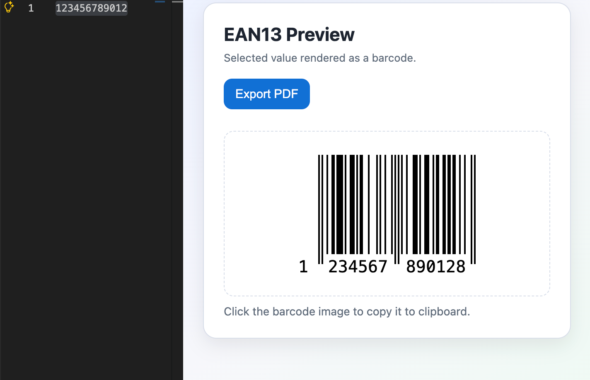

# VS Code Barcode Generator

A VS Code extension that adds a right-click command to generate a barcode from the currently selected text.

## Features

- Right-click in editor selection: `Barcode > Generate Barcode`
- Input handling:
  - 12 digits: generates `EAN13` and appends the computed check digit
  - 13 digits: validates `EAN13` check digit and blocks generation if invalid
  - Other text: lets you choose `Code 128` or `QR Code`
- Preview in a webview
- Click the barcode image to copy it to clipboard (`Copied to clipboard` toast)
- Export the current barcode/QR as an A4 PDF (`Export PDF`)

## Screenshot



## Run locally

1. Open this folder in VS Code.
2. Install dependencies:

```bash
npm install
```

3. Start debugging from `Run and Debug` using `Run Extension`.
4. In the Extension Development Host window:
   - select text in any file
   - right-click
   - click `Barcode > Generate Barcode`

## Publish to VS Code Marketplace

1. Make sure your `publisher` in `package.json` matches your real Marketplace publisher ID.
2. Install dependencies:

```bash
npm install
```

3. Create a VSIX package:

```bash
npm run package:vsix
```

4. Publish:

```bash
npm run publish:vsce
```

You must have a valid Azure DevOps Personal Access Token configured for `vsce` before publishing.

## Main files

- `package.json`: extension manifest, commands, scripts, publishing metadata
- `src/extension.js`: selection rules, EAN13 validation, webview rendering, clipboard copy, PDF export
