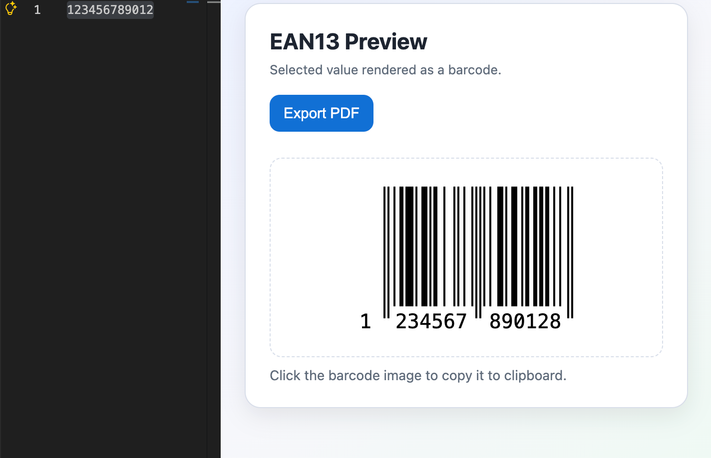

# Barcode Generator

Barcode Generator is a VS Code extension for creating barcodes and QR codes from selected text.

Use it directly from the editor: select one value to preview and export a single code, or select a list of values to generate a PDF containing all codes.

## Features

- Generate `EAN13`, `Code 128`, and `QR Code` from selected text.
- Preview a single barcode or QR code inside VS Code.
- Copy the preview image to the clipboard by clicking it.
- Export a single barcode or QR code as an A4 PDF.
- Select several codes, one per line, and generate one PDF with all barcodes.
- Choose how many barcodes should be printed on each PDF page.

## Generate One Barcode

1. Open a file in VS Code.
2. Select the value you want to encode.
3. Right-click the selection and choose `Barcode > Generate Barcode`.
4. If VS Code asks for a format, choose `Code 128` or `QR Code`.
5. Use the preview to copy the image or click `Export PDF`.

EAN13 values are handled automatically:

- 12 digits: the extension adds the EAN13 check digit.
- 13 digits: the extension validates the check digit before generating the barcode.
- Any other text: the extension asks whether to generate `Code 128` or `QR Code`.

## Generate a PDF From a List

1. Put one code per line in a file.
2. Select the full list.
3. Right-click the selection and choose `Barcode > Generate Barcode`.
4. Choose a format if the list is not entirely EAN13 numeric.
5. Enter the number of barcodes you want per page.
6. Choose where to save the PDF.

Blank lines are ignored.

Example selection:

```text
123456789012
4006381333931
ABC-001
ABC-002
```

If every selected line contains 12 or 13 digits, the PDF is generated as EAN13. If at least one line is not an EAN13 value, the extension asks whether the whole list should be generated as `Code 128` or `QR Code`.

Long labels may be shortened under the printed code so the page layout stays readable. The encoded barcode or QR code still uses the full selected value.

## Supported Formats

`EAN13`

Best for retail product codes. The extension can complete a 12-digit value by adding the check digit, and it rejects invalid 13-digit EAN13 values.

`Code 128`

Best for internal references, serial numbers, order numbers, and mixed text codes.

`QR Code`

Best for URLs or longer text values.

## Common Messages

`Please select text to generate a barcode.`

No text was selected in the active editor.

`Invalid EAN13: check digit parity is incorrect.`

A 13-digit EAN13 value has an invalid check digit. Fix the code or select the values as `Code 128` if they are not meant to be EAN13 barcodes.

`Unable to export PDF`

The extension could not write the PDF to the selected location. Choose another folder or check file permissions.

## Screenshot


